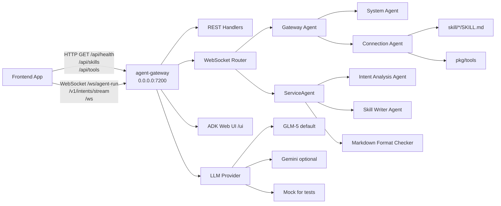

# agentic-layer-custom

ADK-based gateway for signaling orchestration and skill generation. The repository now defaults to GLM-5 through a DashScope-compatible OpenAI endpoint.

## Architecture



## Runtime Configuration

Use `.env` or shell variables to configure the active backend:

```bash
LLM_PROVIDER=glm5
GLM_API_KEY=your_glm_api_key
GLM_BASE_URL=https://dashscope.aliyuncs.com/compatible-mode/v1/chat/completions
GLM_MODEL=glm-5
API_PORT=7200
```

`GLM_BASE_URL` may be either the base path or the full `/chat/completions` URL; the runtime normalizes both forms. `LLM_PROVIDER=mock` is still available for local routing tests that should avoid external model calls.

## Migrating From Kimi

- Change `LLM_PROVIDER=kimi` to `LLM_PROVIDER=glm5`.
- Rename `KIMI_API_KEY`, `KIMI_BASE_URL`, and `KIMI_MODEL` to `GLM_API_KEY`, `GLM_BASE_URL`, and `GLM_MODEL`.
- Replace Moonshot-specific endpoints with the DashScope-compatible GLM-5 endpoint.
