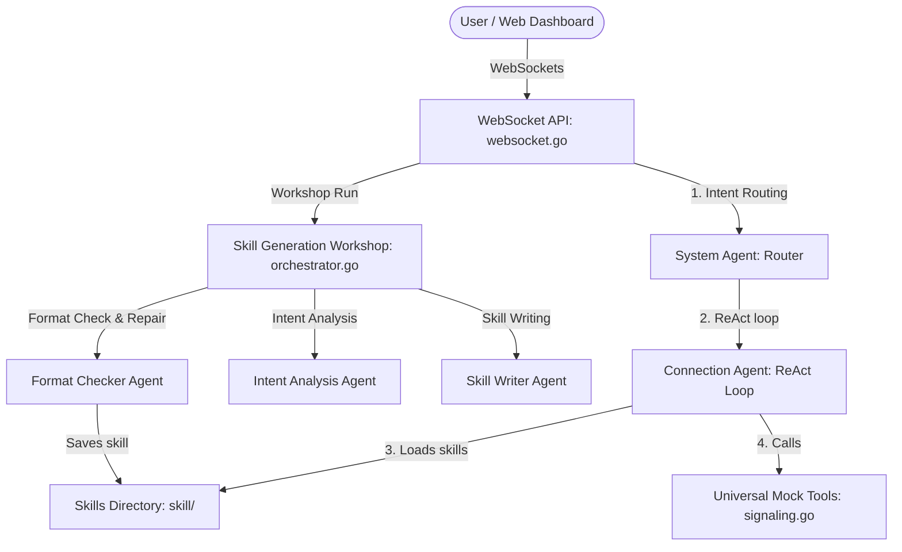

# 6G Agentic Layer Custom — Global Architectural Specs Summary (4+1 View Model)

This document provides a global summary of the 13 specifications in [openspec/specs](https://github.com/acore2026/agentic-layer-custom/blob/main/openspec/specs). It maps the custom agentic gateway architecture using the 4+1 View Model.

The architecture connects user applications to network signaling simulations by routing natural language prompts through a system of coordinated LLM agents. The system replaces static signaling structures with dynamic, LLM-driven skill parsing (ReAct loop) and real-time WebSocket telemetry.



---

## 1. Logical View (Functional & Domain Model)
The logical view describes the object model, interfaces, entities, and static structures of the system.

### AI Providers and Configuration
*   GLM-5 Provider: Implements provider wrappers for OpenAI-compatible chat endpoints targeting DashScope GLM-5 when LLM_PROVIDER is set to glm5. It replaces the previous Kimi provider implementation.
    *   Spec References: [glm5-provider spec](https://github.com/acore2026/agentic-layer-custom/blob/main/openspec/specs/glm5-provider/spec.md) and [kimi-provider spec](https://github.com/acore2026/agentic-layer-custom/blob/main/openspec/specs/kimi-provider/spec.md)
    *   Code Implementation: [glm.go](https://github.com/acore2026/agentic-layer-custom/blob/main/pkg/model/glm.go) and [openai_compatible.go](https://github.com/acore2026/agentic-layer-custom/blob/main/pkg/model/openai_compatible.go)
*   Base URL Normalization: Automatically formats configured endpoints to accommodate both full completions paths and basic API hosts.
    *   Spec Reference: [glm5-provider spec](https://github.com/acore2026/agentic-layer-custom/blob/main/openspec/specs/glm5-provider/spec.md)

### Agent Core Definitions
*   System Agent (Router): Determines user intents and routes them to appropriate downstream worker agents (such as the Connection Agent). It asks for manual clarification when prompts are highly ambiguous.
    *   Spec Reference: [system-agent spec](https://github.com/acore2026/agentic-layer-custom/blob/main/openspec/specs/system-agent/spec.md)
    *   Code Implementation: [system.go](https://github.com/acore2026/agentic-layer-custom/blob/main/pkg/agents/system.go)
*   Connection Agent: Runs a ReAct (Reason + Act) loop using adk-go. It loads custom skill definitions on startup and delegates state management, parameter passing, and tool orchestration to the LLM.
    *   Spec Reference: [connection-agent spec](https://github.com/acore2026/agentic-layer-custom/blob/main/openspec/specs/connection-agent/spec.md)
    *   Code Implementation: [connection.go](https://github.com/acore2026/agentic-layer-custom/blob/main/pkg/agents/connection.go)

### Universal Mock Tooling
*   Universal Mock Tool: Implements a generic Go tool registered under custom names (e.g., Auth_tool) that logs execution to stdout and returns mock maps with common fields (like status and token).
    *   Spec Reference: [universal-mocking spec](https://github.com/acore2026/agentic-layer-custom/blob/main/openspec/specs/universal-mocking/spec.md)
    *   Code Implementation: [signaling.go](https://github.com/acore2026/agentic-layer-custom/blob/main/pkg/tools/signaling.go)

---

## 2. Process View (Workflows & Runtime Communication)
The process view details runtime interactions, concurrency, and dynamic workflows between components.

### WebSocket Communication Streams
*   Intents API (/v1/intents/stream): Establishes a client connection to stream reasoning events, tool execution status, and final summaries in response to user prompts.
    *   Spec Reference: [websocket-api spec](https://github.com/acore2026/agentic-layer-custom/blob/main/openspec/specs/websocket-api/spec.md)
    *   Code Implementation: [websocket.go](https://github.com/acore2026/agentic-layer-custom/blob/main/pkg/api/websocket.go)
*   Skill Generation API (/ws/agent-run): Executes the multi-agent skill writer pipeline, sending progress updates and validation diagnostics to the client.
    *   Spec Reference: [skill-generation spec](https://github.com/acore2026/agentic-layer-custom/blob/main/openspec/specs/skill-generation/spec.md)
    *   Code Implementation: [ws.go](https://github.com/acore2026/agentic-layer-custom/blob/main/pkg/workshop/ws.go)

### Event capturing and Telemetry Streams
*   Granular Telemetry Streamer: Captures prompts, LLM thought chunks (specifically recognizing thought structures with Thought: true), and network events, publishing them as structured JSON objects (ai_payload, llm_thought, network_pcap, workflow_complete).
    *   Spec References: [telemetry-streamer spec](https://github.com/acore2026/agentic-layer-custom/blob/main/openspec/specs/telemetry-streamer/spec.md) and [agent-tracing spec](https://github.com/acore2026/agentic-layer-custom/blob/main/openspec/specs/agent-tracing/spec.md)
    *   Code Implementation: [telemetry.go](https://github.com/acore2026/agentic-layer-custom/blob/main/pkg/telemetry/telemetry.go)
*   PCAP Telemetry Formatting: Converts universal mock tool requests and responses into network_pcap events detailing protocol schemas and directions (request/response).
    *   Spec Reference: [universal-mocking spec](https://github.com/acore2026/agentic-layer-custom/blob/main/openspec/specs/universal-mocking/spec.md)
    *   Code Implementation: [signaling.go](https://github.com/acore2026/agentic-layer-custom/blob/main/pkg/tools/signaling.go)

### Multi-Agent Workshop Generation
*   Specialized Workflow: Executes a sequential pipeline (Intent Analysis Agent -> Skill Writer Agent -> Format Checker Agent) to generate network signaling procedures.
*   Format Check & Iterative Correction: Uses the format checker agent to validate generated markdown against the tool catalog schema (retrieved via GET `/api/tools`), performing up to 3 repair attempts on validation failures before rejecting the run.
    *   Spec Reference: [skill-generation spec](https://github.com/acore2026/agentic-layer-custom/blob/main/openspec/specs/skill-generation/spec.md)
    *   Code Implementation: [orchestrator.go](https://github.com/acore2026/agentic-layer-custom/blob/main/pkg/workshop/orchestrator.go)

---

## 3. Development View (Software Organization & Testing)
The development view highlights how code is structured, packaged, and verified.

### Code Organization
```
.
├── cmd/
│   └── agent-gateway/           # Gateway service entrypoint and mock configurations
├── pkg/
│   ├── agents/                  # System, Connection, and worker agent logic
│   ├── api/                     # REST routes and WebSocket controllers
│   ├── model/                   # GLM-5 model provider and URL helpers
│   ├── observability/           # Integration with telemetry logs
│   ├── telemetry/               # Event marshalling (ai_payload, llm_thought)
│   ├── tools/                   # Universal mocking and catalog definitions
│   └── workshop/                # Multi-agent skill generation workshop
└── skill/                       # Dynamic skill Markdown definitions (SKILL.md)
```

### Automated Verification
*   WebSocket API Tests: Confirms endpoint messaging formats and correct response sequences.
    *   Spec Reference: [websocket-api spec](https://github.com/acore2026/agentic-layer-custom/blob/main/openspec/specs/websocket-api/spec.md)
    *   Tests: [websocket_test.go](https://github.com/acore2026/agentic-layer-custom/blob/main/pkg/api/websocket_test.go)
*   Dynamic Orchestration Tests: Verifies that Connection Agent dynamically registers skills by parsing CALL patterns inside SKILL.md templates.
    *   Spec Reference: [skill-orchestration spec](https://github.com/acore2026/agentic-layer-custom/blob/main/openspec/specs/skill-orchestration/spec.md)
    *   Tests: [skill_orchestration_test.go](https://github.com/acore2026/agentic-layer-custom/blob/main/pkg/agents/skill_orchestration_test.go)
*   Workshop Orchestrator Tests: Verifies format correction repair limits (max 3 loops) and output generation.
    *   Spec Reference: [skill-generation spec](https://github.com/acore2026/agentic-layer-custom/blob/main/openspec/specs/skill-generation/spec.md)
    *   Tests: [orchestrator_test.go](https://github.com/acore2026/agentic-layer-custom/blob/main/pkg/workshop/orchestrator_test.go)

---

## 4. Physical View (Deployment & Configuration)
The physical view outlines environment parameters, endpoints, and deployment details.

### Startup Configuration
*   dotenv Support: Gateway loads local configuration parameters from a `.env` file at startup.
    *   Spec Reference: [env-config spec](https://github.com/acore2026/agentic-layer-custom/blob/main/openspec/specs/env-config/spec.md)
    *   Code Implementation: [main.go](https://github.com/acore2026/agentic-layer-custom/blob/main/cmd/agent-gateway/main.go) using joho/godotenv.
*   Provider Env Variables: Evaluates `GLM_API_KEY`, `GLM_BASE_URL`, `GLM_MODEL`, and `LLM_PROVIDER=glm5` for authenticating connections to the GLM-5 endpoint.

### Dashboard Deployment
*   Web Dashboard Integration: Launches a local server (defaulting to http://localhost:8080) hosting a browser-based UI. The interface allows operators to select active agents (SystemAgent, ConnectionAgent) and visualize tracing logs.
    *   Spec Reference: [web-dashboard spec](https://github.com/acore2026/agentic-layer-custom/blob/main/openspec/specs/web-dashboard/spec.md)

---

## 5. Scenarios (+1 View: Key Execution Flows)
The scenarios view maps user interactions to dynamic system processes.

### Dynamic Skill Execution Sequence
1.  A user inputs "initial registration for UE-01" via the web dashboard.
2.  The System Agent receives the prompt via WebSocket and routes it to the Connection Agent.
3.  The Connection Agent loads skill configurations from [skill/init-registration/SKILL.md](https://github.com/acore2026/agentic-layer-custom/blob/main/skill) and identifies unique tool requirements (e.g. `CALL "Auth_tool"` and `CALL "Subscription_tool"`).
4.  The agent initializes the corresponding blocking mock Go tools.
5.  The Connection Agent processes the prompt using the ReAct loop:
    *   Executes `Auth_tool` and retrieves a token.
    *   Extracts the token via the LLM and feeds it to `Subscription_tool`.
6.  Each execution step streams `llm_thought` logs and simulated `network_pcap` requests/responses back to the web dashboard in real time.

### Workshop Skill Generation Sequence
1.  An operator requests the generation of a new network signaling procedure via the `/ws/agent-run` WebSocket.
2.  The Intent Analysis Agent categorizes the requirement.
3.  The Skill Writer Agent drafts a Markdown structure describing the steps.
4.  The Format Checker Agent compares the draft with the tool catalog schema (obtained via `/api/tools`).
5.  If a schema mismatch occurs (e.g., an invalid tool name):
    *   The Format Checker Agent generates corrections (supporting up to 3 repair loops).
6.  The final valid `SKILL.md` is registered and written into the [skill](https://github.com/acore2026/agentic-layer-custom/blob/main/skill) registry directory.
