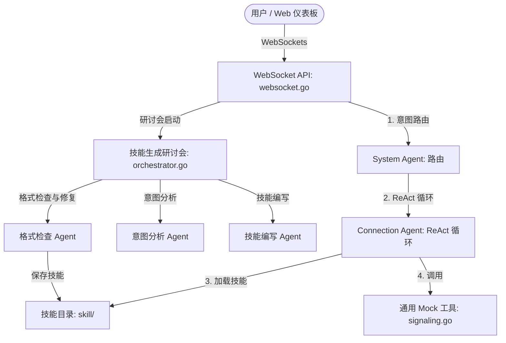

# 6G Agentic Layer Custom — 全局架构规范总结 (4+1 视图模型)

该文档对 [openspec/specs](https://github.com/acore2026/agentic-layer-custom/blob/main/openspec/specs) 目录下的 13 个规范文件进行了全局性总结，并采用软件架构的 4+1 视图模型进行梳理。

整套系统通过协调的 LLM Agent 调度，将用户输入与网络信令模拟相连接。系统通过大模型驱动的动态技能解析 (ReAct 循环) 以及 WebSocket 实时遥测，替代了传统的静态信令逻辑。



---

## 1. 逻辑视图 (功能与领域模型)
逻辑视图描述了系统的静态结构、类与结构体模型、接口定义以及业务实体。

### AI 提供商与配置管理
*   GLM-5 提供商: 当环境变量 LLM_PROVIDER 设置为 glm5 时，为 OpenAI 兼容的 chat 接口提供对 DashScope GLM-5 的封装实现。该提供商替换了原有的 Kimi 适配代码。
    *   规范参考: [glm5-provider spec](https://github.com/acore2026/agentic-layer-custom/blob/main/openspec/specs/glm5-provider/spec.md) 以及 [kimi-provider spec](https://github.com/acore2026/agentic-layer-custom/blob/main/openspec/specs/kimi-provider/spec.md)
    *   代码实现: [glm.go](https://github.com/acore2026/agentic-layer-custom/blob/main/pkg/model/glm.go) 与 [openai_compatible.go](https://github.com/acore2026/agentic-layer-custom/blob/main/pkg/model/openai_compatible.go)
*   基础 URL 规范化: 能够对配置的 API 端点进行自动格式处理，同时兼容完整的 completions 路径以及基础 API 域名。
    *   规范参考: [glm5-provider spec](https://github.com/acore2026/agentic-layer-custom/blob/main/openspec/specs/glm5-provider/spec.md)

### Agent 核心定义
*   System Agent (路由器): 对用户输入进行分类，并将其路由给相应的 Worker Agent（例如 Connection Agent）。当意图非常模糊时，它会主动发起人工澄清提示。
    *   规范参考: [system-agent spec](https://github.com/acore2026/agentic-layer-custom/blob/main/openspec/specs/system-agent/spec.md)
    *   代码实现: [system.go](https://github.com/acore2026/agentic-layer-custom/blob/main/pkg/agents/system.go)
*   Connection Agent (连接代理): 利用 adk-go 运行 ReAct 推理/执行环。它在服务启动时自动载入定制的技能定义文件，并将状态参数管理、工具间参数传递和任务流调度全权交由 LLM 执行。
    *   规范参考: [connection-agent spec](https://github.com/acore2026/agentic-layer-custom/blob/main/openspec/specs/connection-agent/spec.md)
    *   代码实现: [connection.go](https://github.com/acore2026/agentic-layer-custom/blob/main/pkg/agents/connection.go)

### 通用 Mock 工具链
*   通用 Mock 工具: 实现了可以注册为任意自定义名称（如 Auth_tool）的通用 Go 工具，支持在控制台打印工具调用日志，并返回包含 status 和 token 等共有字段的 Mock 成功响应。
    *   规范参考: [universal-mocking spec](https://github.com/acore2026/agentic-layer-custom/blob/main/openspec/specs/universal-mocking/spec.md)
    *   代码实现: [signaling.go](https://github.com/acore2026/agentic-layer-custom/blob/main/pkg/tools/signaling.go)

---

## 2. 过程视图 (工作流与运行时通信)
过程视图揭示了系统运行期间微服务组件之间的动态交互、时序机制、并发及通信流。

### WebSocket 实时通信流
*   意图流式 API (/v1/intents/stream): 建立长连接，用于向客户端流式返回推理状态、工具调用进程以及最终的工作流归纳汇总。
    *   规范参考: [websocket-api spec](https://github.com/acore2026/agentic-layer-custom/blob/main/openspec/specs/websocket-api/spec.md)
    *   代码实现: [websocket.go](https://github.com/acore2026/agentic-layer-custom/blob/main/pkg/api/websocket.go)
*   技能生成 API (/ws/agent-run): 启动多 Agent 技能编写流水线，并实时将执行进度和格式验证反馈流式返回给连接客户端。
    *   规范参考: [skill-generation spec](https://github.com/acore2026/agentic-layer-custom/blob/main/openspec/specs/skill-generation/spec.md)
    *   代码实现: [ws.go](https://github.com/acore2026/agentic-layer-custom/blob/main/pkg/workshop/ws.go)

### 事件拦截与遥测广播
*   高精遥测流: 实时捕获交互 Prompt、LLM 思考片段（捕获 Thought: true 字段）以及底层网络信令，将其序列化为 structured JSON 事件（ai_payload, llm_thought, network_pcap, workflow_complete）。
    *   规范参考: [telemetry-streamer spec](https://github.com/acore2026/agentic-layer-custom/blob/main/openspec/specs/telemetry-streamer/spec.md) 以及 [agent-tracing spec](https://github.com/acore2026/agentic-layer-custom/blob/main/openspec/specs/agent-tracing/spec.md)
    *   代码实现: [telemetry.go](https://github.com/acore2026/agentic-layer-custom/blob/main/pkg/telemetry/telemetry.go)
*   PCAP 格式数据包序列化: 将通用 Mock 工具的请求与响应拦截并转化为符合网络数据包协议格式的 network_pcap 事件。
    *   规范参考: [universal-mocking spec](https://github.com/acore2026/agentic-layer-custom/blob/main/openspec/specs/universal-mocking/spec.md)
    *   代码实现: [signaling.go](https://github.com/acore2026/agentic-layer-custom/blob/main/pkg/tools/signaling.go)

### 研讨会多 Agent 动态技能生成
*   流程式协作: 由 意图分析 Agent -> 技能编写 Agent -> 格式检查 Agent 串联构成技能生成管道。
*   格式匹配与循环修复: 格式检查 Agent 会将生成的 markdown 流程与工具目录定义（GET `/api/tools`）进行校验，如校验失败，可执行最高 3 次自动修正循环，超过则判定为生成失败。
    *   规范参考: [skill-generation spec](https://github.com/acore2026/agentic-layer-custom/blob/main/openspec/specs/skill-generation/spec.md)
    *   代码实现: [orchestrator.go](https://github.com/acore2026/agentic-layer-custom/blob/main/pkg/workshop/orchestrator.go)

---

## 3. 开发视图 (软件组织与测试验证)
开发视图描述了代码在开发周期中的物理包模块划分、代码分布以及测试策略。

### 目录与包映射
```
.
├── cmd/
│   └── agent-gateway/           # 互通网关服务启动入口及 Mock LLM 驱动
├── pkg/
│   ├── agents/                  # 包含 System、Connection 核心代理实现
│   ├── api/                     # REST 和 WebSocket 端点控制器
│   ├── model/                   # 大模型封装与配置
│   ├── observability/           # 外部观测日志集成
│   ├── telemetry/               # 事件遥测序列化机制
│   ├── tools/                   # 通用 Mock 工具和目录解析器
│   └── workshop/                # 研讨会多代理技能编写与修复引擎
└── skill/                       # 存放 SKILL.md 技能模板文件的物理目录
```

### 测试验证机制
*   WebSocket API 接口测试: 校验建立长连接的各指令时序及消息载荷正确性。
    *   规范参考: [websocket-api spec](https://github.com/acore2026/agentic-layer-custom/blob/main/openspec/specs/websocket-api/spec.md)
    *   测试代码: [websocket_test.go](https://github.com/acore2026/agentic-layer-custom/blob/main/pkg/api/websocket_test.go)
*   技能动态载入测试: 验证 Connection Agent 是否能通过匹配 `SKILL.md` 模板中的 CALL 标记动态提取和注册对应的 Go 工具。
    *   规范参考: [skill-orchestration spec](https://github.com/acore2026/agentic-layer-custom/blob/main/openspec/specs/skill-orchestration/spec.md)
    *   测试代码: [skill_orchestration_test.go](https://github.com/acore2026/agentic-layer-custom/blob/main/pkg/agents/skill_orchestration_test.go)
*   研讨会工作流测试: 验证 3 次修复重试上限限制以及生成状态返回逻辑。
    *   规范参考: [skill-generation spec](https://github.com/acore2026/agentic-layer-custom/blob/main/openspec/specs/skill-generation/spec.md)
    *   测试代码: [orchestrator_test.go](https://github.com/acore2026/agentic-layer-custom/blob/main/pkg/workshop/orchestrator_test.go)

---

## 4. 物理视图 (部署与配置管理)
物理视图展现了组件部署节点、通信端点、系统集成依赖及环境变量接口。

### 服务启动配置
*   .env 加载支持: 微服务网关启动时支持通过 joho/godotenv 自动加载本地 `.env` 环境变量配置文件。
    *   规范参考: [env-config spec](https://github.com/acore2026/agentic-layer-custom/blob/main/openspec/specs/env-config/spec.md)
    *   代码实现: [main.go](https://github.com/acore2026/agentic-layer-custom/blob/main/cmd/agent-gateway/main.go)
*   服务商环境变量: 系统评估并加载 `GLM_API_KEY`, `GLM_BASE_URL`, `GLM_MODEL`, 且在 `LLM_PROVIDER=glm5` 时连接 DashScope 端点。

### 可视化仪表板部署
*   Web 页面仪表板集成: 本地网关启动后，可以开启 `http://localhost:8080` 本地 Web 页面。该页面允许运维人员按需选择活动代理 (SystemAgent, ConnectionAgent) 并实时观测其推理日志流。
    *   规范参考: [web-dashboard spec](https://github.com/acore2026/agentic-layer-custom/blob/main/openspec/specs/web-dashboard/spec.md)

---

## 5. 场景视图 (+1 核心运行流程)
场景视图将其他视图串联起来，描述了系统的实际业务逻辑流。

### 动态技能编排执行流程
1.  用户通过 Web 仪表板发起包含意图的信息（如 “initial registration for UE-01”）。
2.  System Agent 在后端接收该 WebSocket 意图，并将其分类分发给 Connection Agent。
3.  Connection Agent 会扫描加载 [skill/init-registration/SKILL.md](https://github.com/acore2026/agentic-layer-custom/blob/main/skill) 文件，提取其中包含的工具调用声明（如 `CALL "Auth_tool"` 和 `CALL "Subscription_tool"`）。
4.  Connection Agent 动态初始化所需的 Mock 工具实例。
5.  Connection Agent 在 ReAct 推理环中进行多次推理：
    *   调用 `Auth_tool` 并从其返回结果中取得临时 Token。
    *   通过 LLM 进行状态捕获，并将该 Token 动态当作实参传入 `Subscription_tool` 中。
6.  所有的执行步骤与网络数据封包，均以 `llm_thought` 与 `network_pcap` 形式实时推送至前端 UI 仪表板进行动态链路跟踪展示。

### 技能自动生成流程
1.  操作人员在 `/ws/agent-run` 路径下请求自动生成一个新的信令定义程序。
2.  意图分析 Agent 首先对该提示词的要求进行意图提取。
3.  技能编写 Agent 生成对应的 markdown 步骤文本草案。
4.  格式检查 Agent 校验该草案是否符合当前现存的工具列表定义格式（GET `/api/tools`）。
5.  若校验发生类似参数缺失或工具名称拼写错误：
    *   格式检查 Agent 会自主结合报错上下文自动回炉进行重新编辑（最多重试 3 次）。
6.  生成通过后，将合格的 `SKILL.md` 正式落地存储至 [skill](https://github.com/acore2026/agentic-layer-custom/blob/main/skill) 物理技能注册表目录下。
